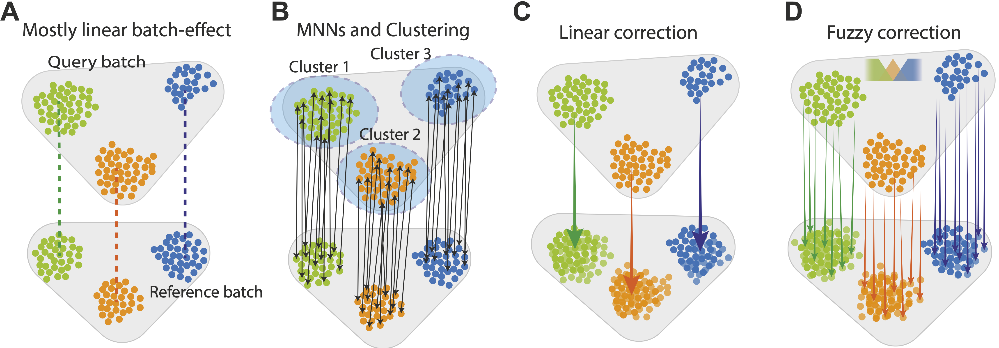

<!-- README.md is generated from README.Rmd. Please edit that file -->

```{r, include = FALSE}
knitr::opts_chunk$set(
  collapse = TRUE,
  comment = "#>",
  fig.path = "man/figures/README-",
  out.width = "100%"
)
```

<!--{width="100"}<!-- -->

<p align="center">
  
</p>

# Canek

<!-- badges: start -->
[](https://github.com/MartinLoza/Canek/actions/workflows/R-CMD-check.yaml)
[](https://cran.r-project.org/package=Canek)
[](https://cran.r-project.org/package=Canek)
[](https://cran.r-project.org/package=Canek)
<!-- badges: end -->

*Canek is an R package to correct batch effects from single-cell RNA-seq biological replicates*.

### Motivation to develop Canek

As single-cell genomics technologies become mainstream, more laboratories will perform experiments under different conditions with biological replicates obtained using a common technology. In this scenario, integration of datasets with minimal impact on cell phenotype is essential.

### The workflow

Canek leverages information from mutual nearest neighbors to combine local linear corrections with cell-specific non-linear corrections within a fuzzy logic framework. 

<p align="center">
  
</p>

<font size="2">

> A. Canek starts with a reference batch and query batch, assuming a predominantly linear batch effect.
>
> B. Cell clusters are defined on the query batch and MNN pairs (arrows) are used to define batch effect observations.
>
> C. The MNN pairs from each cluster are used to estimate cluster specific correction vectors. These vectors can be used to correct the batch effect or, (D) a non-linear correction can be applied by calculating cell-specific correction vectors using fuzzy logic.

<font size="3"> 

### Results

Canek was the highest scored method in tests specifically designed to assess **over-correction**, where Canek corrected batch effects without distortion to the structures of cells as compared with a gold standard.

For more information about Canek check out our manuscript in [NAR Genomics and Bioinformatics](https://doi.org/10.1093/nargab/lqac022).

## What's new in 0.3.0

- **Latest updates**: `RunCanek()` on Seurat objects now defaults to `correctEmbeddings = TRUE` — correction happens in PCA-embedding space instead of on gene expression directly, and the result is a new `"canek"` reduction rather than a `"Canek"` assay. Pass `correctEmbeddings = FALSE` to keep the previous behavior.
- `pcaDim` is inferred automatically from an existing `"pca"` reduction when present, and reused directly instead of being recomputed.
- Added SCTransform support, including automatic reconciliation checks for batches normalized separately.
- Added a repeat-correction loop (`maxLoop`/`loopTol`) that refines the correction across multiple passes.

See the [full changelog](https://martinloza.github.io/Canek/news/index.html) for details.

## Usage

You can use Canek directly with *normalized-count matrices*, *Seurat* objects or *SingleCellExperiment* objects. As of Canek 0.3.0, correcting Seurat objects defaults to PCA-embedding space (`correctEmbeddings = TRUE`) rather than gene expression directly, and both log-normalized and SCTransform-normalized data are supported. For more details, check out our GitHub page and vignettes:

- [Canek website](https://martinloza.github.io/Canek/index.html)
- [Run Canek on a toy example vignette](https://martinloza.github.io/Canek/articles/toy_example.html)
- [Correct log-normalized Seurat data](https://martinloza.github.io/Canek/articles/seurat.html)
- [Correct SCTransform-normalized Seurat data](https://martinloza.github.io/Canek/articles/SCTransform.html)
- [Run Canek on SingleCellExperiment objects vignette](https://martinloza.github.io/Canek/articles/SingleCellExperiment.html)

For vignettes related to the previous `v0.2.x` version, see [Previous versions](https://martinloza.github.io/Canek/articles/legacy.html).

## Installation

You can install the release version of Canek from [CRAN](https://CRAN.R-project.org) with:

```
install.packages("Canek")
```

You can install the development version from [GitHub](https://github.com/) with:

``` r
# install.packages("remotes")
remotes::install_github("MartinLoza/Canek")
```

## Citation

If you use Canek in your research please cite our work using:

```{r echo=FALSE, results='asis', comment=""}
cit <- citation("Canek")
print(cit, style = "text")
```
