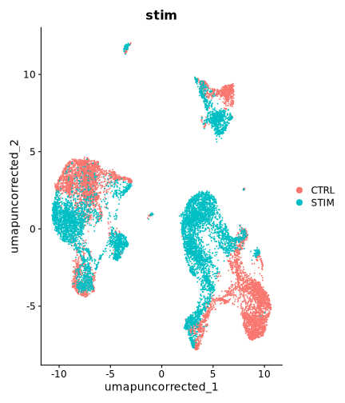
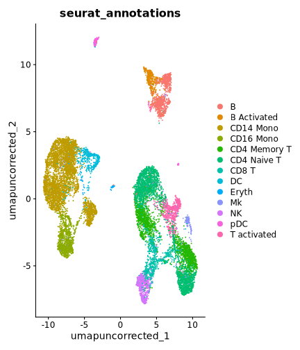
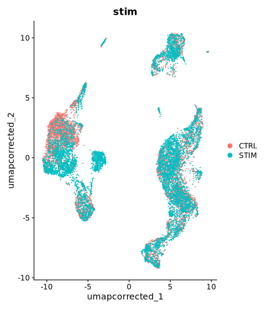
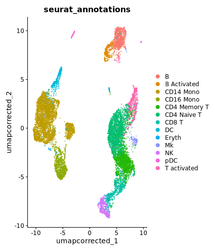

`SCTransform` is normally fit *separately per batch* before merging — that's
Seurat's own recommended way to run it ahead of integration. That means each
batch's residuals live on a different, non-comparable scale. `RunCanek()`'s
default `correctEmbeddings = TRUE` corrects in PCA-embedding space, and by
default reuses whatever `"pca"` reduction already exists on the object
instead of computing its own (see
[Correct log-normalized Seurat data](seurat.html) for that default path). For
SCTransform-normalized data specifically, we should reconcile the per-batch
normalizations so that the batch-to-batch scale mismatch is accounted for in
the correction. This vignette shows the reconciliation Seurat itself provides
for exactly this problem, and how `RunCanek()` uses it — using the same
`ifnb` dataset as [Seurat's own integration
tutorial](https://satijalab.org/seurat/articles/integration_introduction)
and the [main Seurat vignette](seurat.html) here.

`ifnb` is loaded from the [SeuratData](https://github.com/satijalab/seurat-data)
package rather than CRAN, so it needs a one-time install the first time you
use it:


``` r
if (!requireNamespace("SeuratData", quietly = TRUE)) {
  install.packages("remotes")
  remotes::install_github("satijalab/seurat-data")
}
SeuratData::InstallData("ifnb")
```


``` r
library(Canek)
library(Seurat)
#> Loading required package: SeuratObject
#> Loading required package: sp
#> 
#> Attaching package: 'SeuratObject'
#> The following objects are masked from 'package:base':
#> 
#>     intersect, t
library(SeuratData)
#> ── Installed datasets ──────────────────────────────── SeuratData v0.2.2.9002 ──
#> ✔ ifnb  3.1.0                           ✔ panc8 3.0.2
#> ────────────────────────────────────── Key ─────────────────────────────────────
#> ✔ Dataset loaded successfully
#> ❯ Dataset built with a newer version of Seurat than installed
#> ❓ Unknown version of Seurat installed
```

# Create and SCTransform-normalize per batch

We split `ifnb` by `stim` into separate per-batch objects and normalize each
one independently with `SCTransform` — mirroring how you'd normally run it
ahead of integration.


``` r
ifnb <- LoadData("ifnb")
#> Validating object structure
#> Updating object slots
#> Ensuring keys are in the proper structure
#> Warning: Assay RNA changing from Assay to Assay
#> Ensuring keys are in the proper structure
#> Ensuring feature names don't have underscores or pipes
#> Updating slots in RNA
#> Validating object structure for Assay 'RNA'
#> Object representation is consistent with the most current Seurat version
#> Warning: Assay RNA changing from Assay to Assay5
x <- SplitObject(ifnb, split.by = "stim")
x <- suppressWarnings(lapply(x, SCTransform, verbose = FALSE))
#> `vst.flavor` is set to 'v2' but could not find glmGamPoi installed.
#> Please install the glmGamPoi package for much faster estimation.
#> --------------------------------------------
#> install.packages('BiocManager')
#> BiocManager::install('glmGamPoi')
#> --------------------------------------------
#> Falling back to native (slower) implementation.
#> `vst.flavor` is set to 'v2' but could not find glmGamPoi installed.
#> Please install the glmGamPoi package for much faster estimation.
#> --------------------------------------------
#> install.packages('BiocManager')
#> BiocManager::install('glmGamPoi')
#> --------------------------------------------
#> Falling back to native (slower) implementation.
```

# What happens without reconciling first

If we just merge the independently-normalized batches and call `RunCanek()`
without computing a joint PCA on reconciled data first, it stops with an
error:


``` r
naive <- merge(x[[1]], x[[2]])
DefaultAssay(naive) <- "SCT"
RunCanek(naive, "stim")
#> Error:
#> ! No existing 'pca' reduction found, but assay 'SCT' is SCTransform-normalized. Canek can't safely compute its own PCA from SCTransform residuals fit per batch,
#>       since they are on different scales (see SCTransform documentation).
#> To implement Canek, first reconcile the normalized data and compute a joint PCA first, e.g.:
#>   features <- SelectIntegrationFeatures(object.list, nfeatures = 3000)
#>   object.list <- PrepSCTIntegration(object.list, anchor.features = features)
#>   x <- merge(object.list[[1]], object.list[[2]], ...)
#>   x <- RunPCA(x)
#> then call RunCanek() again.
```

# Reconciling the per-batch models

`RunCanek()`'s error points at the fix: select integration features across
the independent models, reconcile the batches' residuals onto a comparable
scale for those features (`PrepSCTIntegration`), merge, and compute a joint
PCA on the reconciled data.


``` r
features <- SelectIntegrationFeatures(x, nfeatures = 3000)
x <- suppressWarnings(PrepSCTIntegration(x, anchor.features = features))

x <- merge(x[[1]], x[[2]])
DefaultAssay(x) <- "SCT"
VariableFeatures(x) <- features
x <- RunPCA(x, verbose = FALSE)
```

## UMAP before correction


``` r
x <- RunUMAP(x, reduction = "pca", dims = 1:ncol(Embeddings(x, "pca")),
             reduction.name = "umap_uncorrected", verbose = FALSE)
#> Warning: The default method for RunUMAP has changed from calling Python UMAP via reticulate to the R-native UWOT using the cosine metric
#> To use Python UMAP via reticulate, set umap.method to 'umap-learn' and metric to 'correlation'
#> This message will be shown once per session
DimPlot(x, reduction = "umap_uncorrected", group.by = "stim")
```

<div class="figure" style="text-align: center">

<p class="caption">plot of chunk unnamed-chunk-6</p>
</div>

``` r
DimPlot(x, reduction = "umap_uncorrected", group.by = "seurat_annotations")
```

<div class="figure" style="text-align: center">

<p class="caption">plot of chunk unnamed-chunk-6</p>
</div>

# Run Canek

With a `"pca"` reduction now present on properly reconciled data,
`RunCanek()` reuses it directly instead of recomputing one — the SCT assay
is auto-detected, so we don't need to pass `assay = "SCT"` explicitly.


``` r
x <- RunCanek(x, "stim")
Reductions(x)
#> [1] "pca"              "umap_uncorrected" "canek"
ncol(Embeddings(x, "canek"))
#> [1] 50
```

## UMAP after correction

As with the log-normalized workflow, downstream steps should use the
`"canek"` reduction directly rather than re-running `ScaleData`/`RunPCA` on
the SCT assay.


``` r
x <- RunUMAP(x, reduction = "canek", dims = 1:ncol(Embeddings(x, "canek")),
             reduction.name = "umap_corrected", verbose = FALSE)
DimPlot(x, reduction = "umap_corrected", group.by = "stim")
```

<div class="figure" style="text-align: center">

<p class="caption">plot of chunk unnamed-chunk-8</p>
</div>

``` r
DimPlot(x, reduction = "umap_corrected", group.by = "seurat_annotations")
```

<div class="figure" style="text-align: center">

<p class="caption">plot of chunk unnamed-chunk-8</p>
</div>

## Session info


``` r
sessionInfo()
#> R version 4.4.3 (2025-02-28)
#> Platform: x86_64-conda-linux-gnu
#> Running under: Ubuntu 22.04.2 LTS
#> 
#> Matrix products: default
#> BLAS/LAPACK: /home/mloza/miniconda3/envs/canek-check/lib/libopenblasp-r0.3.33.so;  LAPACK version 3.12.0
#> 
#> locale:
#>  [1] LC_CTYPE=C.UTF-8       LC_NUMERIC=C           LC_TIME=C.UTF-8       
#>  [4] LC_COLLATE=C.UTF-8     LC_MONETARY=C.UTF-8    LC_MESSAGES=C.UTF-8   
#>  [7] LC_PAPER=C.UTF-8       LC_NAME=C              LC_ADDRESS=C          
#> [10] LC_TELEPHONE=C         LC_MEASUREMENT=C.UTF-8 LC_IDENTIFICATION=C   
#> 
#> time zone: Asia/Tokyo
#> tzcode source: system (glibc)
#> 
#> attached base packages:
#> [1] stats     graphics  grDevices utils     datasets  methods   base     
#> 
#> other attached packages:
#> [1] future_1.70.0          panc8.SeuratData_3.0.2 ifnb.SeuratData_3.1.0 
#> [4] SeuratData_0.2.2.9002  Seurat_5.5.1           SeuratObject_5.4.0    
#> [7] sp_2.2-1               Canek_0.3.1           
#> 
#> loaded via a namespace (and not attached):
#>   [1] RColorBrewer_1.1-3     jsonlite_2.0.0         magrittr_2.0.5        
#>   [4] spatstat.utils_3.2-4   modeltools_0.2-24      farver_2.1.2          
#>   [7] vctrs_0.7.3            ROCR_1.0-12            spatstat.explore_3.8-0
#>  [10] htmltools_0.5.9        BiocNeighbors_2.0.0    sctransform_0.4.3     
#>  [13] parallelly_1.48.0      KernSmooth_2.23-26     htmlwidgets_1.6.4     
#>  [16] ica_1.0-3              plyr_1.8.9             plotly_4.12.0         
#>  [19] zoo_1.8-15             igraph_2.3.3           mime_0.13             
#>  [22] lifecycle_1.0.5        pkgconfig_2.0.3        Matrix_1.7-5          
#>  [25] R6_2.6.1               fastmap_1.2.0          fitdistrplus_1.2-6    
#>  [28] shiny_1.14.0           digest_0.6.39          patchwork_1.3.2       
#>  [31] S4Vectors_0.44.0       numbers_0.9-2          tensor_1.5.1          
#>  [34] RSpectra_0.16-2        irlba_2.3.7            labeling_0.4.3        
#>  [37] progressr_1.0.0        spatstat.sparse_3.2-0  httr_1.4.8            
#>  [40] polyclip_1.10-7        abind_1.4-8            compiler_4.4.3        
#>  [43] withr_3.0.3            S7_0.2.2               BiocParallel_1.40.0   
#>  [46] fastDummies_1.7.6      MASS_7.3-66            rappdirs_0.3.4        
#>  [49] bluster_1.16.0         tools_4.4.3            lmtest_0.9-40         
#>  [52] otel_0.2.0             prabclus_2.3-5         httpuv_1.6.17         
#>  [55] future.apply_1.20.2    nnet_7.3-20            goftest_1.2-3         
#>  [58] glue_1.8.1             nlme_3.1-169           promises_1.5.0        
#>  [61] grid_4.4.3             Rtsne_0.17             cluster_2.1.8.2       
#>  [64] reshape2_1.4.5         generics_0.1.4         gtable_0.3.6          
#>  [67] spatstat.data_3.1-9    class_7.3-23           tidyr_1.3.2           
#>  [70] data.table_1.18.4      flexmix_2.3-20         BiocGenerics_0.52.0   
#>  [73] spatstat.geom_3.8-1    RcppAnnoy_0.0.23       ggrepel_0.9.8         
#>  [76] RANN_2.6.2             pillar_1.11.1          stringr_1.6.0         
#>  [79] spam_2.11-4            RcppHNSW_0.7.0         later_1.4.8           
#>  [82] robustbase_0.99-7      splines_4.4.3          dplyr_1.2.1           
#>  [85] lattice_0.22-9         survival_3.8-9         FNN_1.1.4.1           
#>  [88] deldir_2.0-4           tidyselect_1.2.1       miniUI_0.1.2          
#>  [91] pbapply_1.7-4          knitr_1.51             gridExtra_2.3.1       
#>  [94] scattermore_1.2        stats4_4.4.3           xfun_0.60             
#>  [97] diptest_0.77-2         matrixStats_1.5.0      DEoptimR_1.2-0        
#> [100] stringi_1.8.7          lazyeval_0.2.3         evaluate_1.0.5        
#> [103] codetools_0.2-20       kernlab_0.9-33         tibble_3.3.1          
#> [106] cli_3.6.6              uwot_0.2.4             xtable_1.8-8          
#> [109] reticulate_1.46.0      Rcpp_1.1.2             globals_0.19.1        
#> [112] spatstat.random_3.4-5  png_0.1-9              spatstat.univar_3.2-0 
#> [115] parallel_4.4.3         ggplot2_4.0.3          dotCall64_1.2         
#> [118] mclust_6.1.3           listenv_1.0.0          viridisLite_0.4.3     
#> [121] scales_1.4.0           ggridges_0.5.7         purrr_1.2.2           
#> [124] crayon_1.5.3           fpc_2.2-14             rlang_1.3.0           
#> [127] cowplot_1.2.0
```
